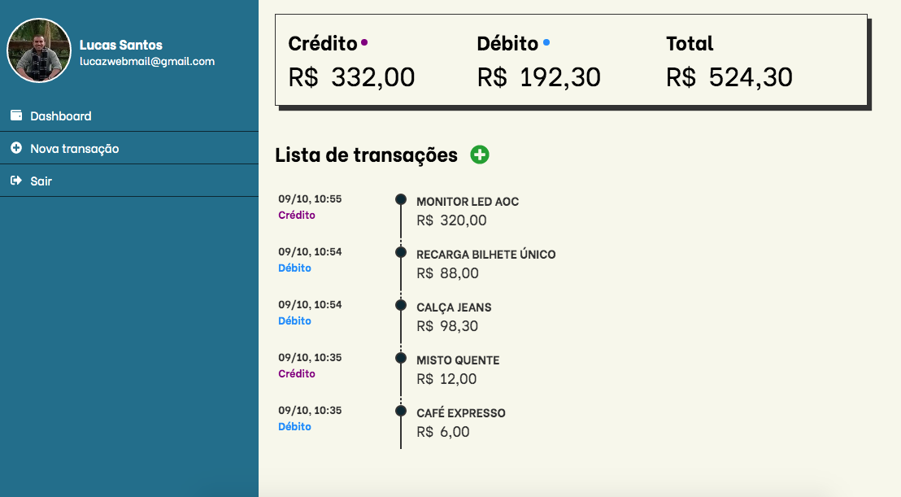
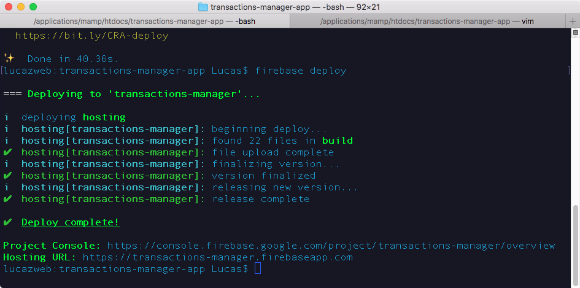

# Transactions Manager

Uma aplicação React / Redux, integrada com Firebase, que permite aos usuários gerenciar transações de crédito ou débito de maneira simples.

  - Inserir ou remover transações de crédito ou débito
  - Visualizar o valor total de transações e de cada categoria
  - [Link em produção](https://transactions-manager.firebaseapp.com) :rocket:



### Instalação

Essa aplicação precisa ter o [Node.js v.10](https://nodejs.org/en/) ou superior instalado no ambiente para funcionar corretamente.

Execute os seguintes comandos para instalar:
```
$ git clone https://www.github.com/lucazweb/transactions-manager-app
```
Na raiz do projeto, executar:
```
$ yarn
```
ou
```
$ npm install
```

### Tecnologia
Para o desenvolvimento da aplicação, foram utilizados os seguintes pacotes:

* @fortawesome/fontawesome-svg-core 1.2.25
* @fortawesome/free-solid-svg-icons 5.11.2
* @fortawesome/react-fontawesome 0.1.5
* firebase 7.1.0
* lottie-react-web 2.1.4
* moment 2.24.0
* node-sass 4.12.0
* react 16.10.2
* react-dom 16.10.2
* react-preloading-component 0.0.5
* react-redux 7.1.1
* react-router-dom 5.1.2
* react-scripts 3.2.0
* redux 4.0.4
* format-currency-to-br 1.0.0
* cypress 3.4.1 (dev)

#### Uso do Lottie Animations - Atribuição
Animação sob licença Creative Commons, de autoria [MySOS Family](https://lottiefiles.com/mysosfamily)

#### Testes end-to-end com cypress
Para os executar os testes end-to-end com cypress, basta seguir os seguintes passos:
1. Limpar as transações cadastradas
2. Executar `yarn e2e`  ou  `npm run e2e`

#### Gerando um Build para produção
Gere uma versão para produção utilizando os seguintes comandos:
```
$ yarn build
```
ou
```
$ npm build
```
#### Firebase Deploy
Para fazer um deploy no Firebase hosting service, é preciso ter o pacote firebase-tools instalado globalmente, para isso execute os seguintes comandos:
```
yarn global add firebase-tools
```
ou
```
$ npm install -g firebase-tools
```
feito isso, é preciso criar um projeto na sua conta firebase, e configurar o projeto localmente com os dados da aplicação, é possível encontrar as configurações de hosting no arquivo firebase.json. Com o paco firebase-tools, fica muito fácil criar essa configuração a partir do comando `firebase init`, feito isso basta rodar o build novamente com o comando `yarn build`, e então executar:
```
$ firebase deploy
```
Acesse o endereço gerado pelo firebase onde a aplicação está hospedada



```
https://<nome_da_app_firebase>.firebaseapp.com
```

### Contribuição
Que tal contribuir com o projeto? É muito fácil, saiba como acessando o nosso [CONTRIBUTING.md](./CONTRIBUTING.md)

### Licença
Essa aplicação está licenciada de acordo com os termos MIT
